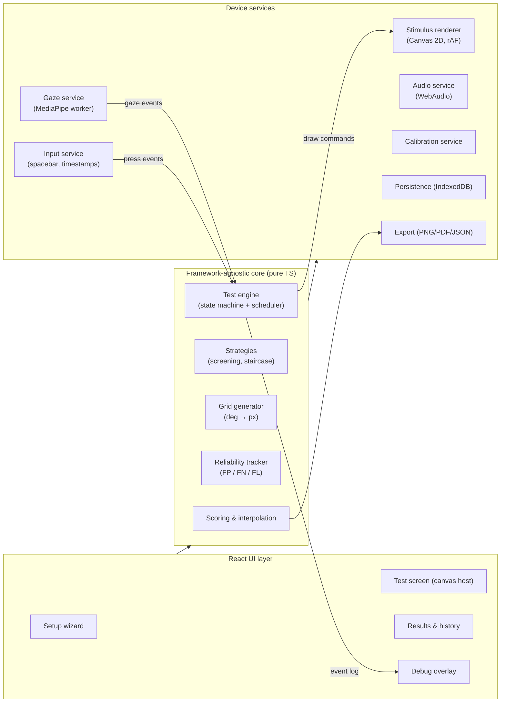
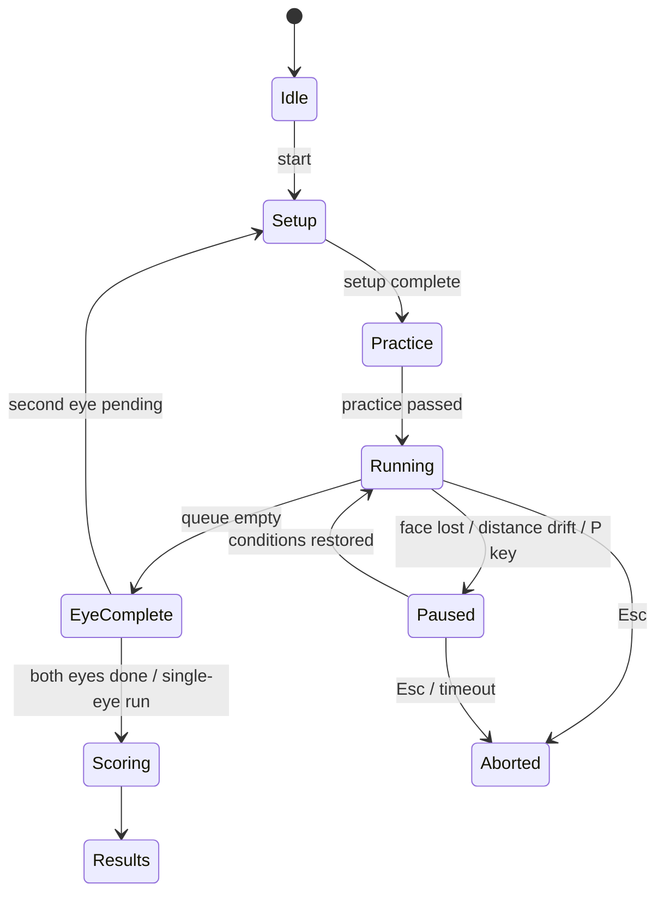

# PeriVision — Development Plan

**Goal:** a web app that runs a visual field test (perimetry) on an ordinary laptop — screen + keyboard + webcam — and produces, per eye, a printable field map comparable in layout and usefulness to the output of a clinical automated perimeter (e.g. a Humphrey Field Analyzer printout).

- **Status:** implemented — M0–M7 are built and tested; M8 (human validation) is the remaining work. See [Implementation status](#implementation-status).
- **Repository:** `mdaldoss/PeriVision-visual-field-tester`
- **Date:** 2026-07-27

## Implementation status

The app in `src/` implements this plan. Where reality forced a change, the plan text below is left as written and the deviation is recorded here.

| Milestone | State | Notes |
|---|---|---|
| M0 Foundation | ✅ | Vite/React/TS, ESLint, Vitest, Playwright, CI + Pages workflows |
| M1 Core engine | ✅ | `src/core/engine.ts` — state machine, scheduler, seeded RNG, replayable event log |
| M2 Setup & calibration | ✅ | Bank-card screen calibration, computed distance, live webcam distance gauge |
| M3 Reliability core | ✅ | Response windows, false-trigger classes, FP/FN catch trials, blind-spot mapping, adaptive ISI, pause/resume, practice |
| M4 Gaze monitoring | ✅ | MediaPipe worker, 5-point calibration, deviation/blink veto + requeue, eye-cover check, drift pause |
| M5 Strategies & grids | ✅ | Adaptive grid generator, suprathreshold screening, 4-2 staircase, pseudo-dB LUT + ordered dithering |
| M6 Results & reports | ✅ | Numeric + interpolated grayscale maps, reliability block, PNG/PDF/JSON export, IndexedDB history |
| M7 Debug mode & polish | ✅ | Overlay, event console, per-event sounds, simulate controls, en/it locales |
| M8 Validation & beta | ⬜ | Needs real users and real hardware; nothing here can be faked in software |

**Deviations from the plan as written:**

1. **24-2 coverage floor lowered from 60% to 50%.** A 13″ 16:9 panel keeps only ~59% of the pattern at 30 cm, so a 60% floor blocked the default test on very common hardware. What survives is still a genuine central field test, and the report always prints the extent actually covered (§3.1 already anticipated adaptive grids).
2. **Catch-trial scheduling is deficit-driven, not a flat probability.** A flat 6% over a ~55-trial screening run yields two or three catch trials, from which a "false positive rate" is meaningless. The engine now targets a minimum count (8 FP / 6 FN / 6 blind-spot) and raises the rate when it is behind, so short runs still produce a usable reliability index.
3. **Staircase seeding from neighbours is clamped to ±6 dB of the age-expected value.** Unclamped, one deep defect seeded its healthy neighbours far too low and the defect visibly smeared outwards across the map.
4. **False-positive rate is the worse of two measures** — the clinical catch-trial rate and the stray-press rate (presses too early, or with no stimulus in the window) — because a user who presses on a rhythm can miss every catch trial and still be unreliable.
5. **Grayscale ramp is clamped at 34 dB**, not the display's theoretical ceiling (~45 dB), or a perfectly normal field prints as mid-gray.
6. **Eye-cover mismatch blocks with an override** rather than hard-blocking: a false positive from the camera would otherwise strand the user.
7. **ZEST-style Bayesian strategy** remains a fast-follow, as the plan scheduled it.

> ⚠️ **Medical disclaimer (drives many decisions below).** PeriVision is a screening / self-monitoring / educational tool. A consumer laptop cannot be photometrically calibrated like a certified perimeter, so results are *indicative*, not diagnostic. The app must state this prominently and never claim to diagnose glaucoma or any disease. See [§12 Privacy, safety & regulatory](#12-privacy-safety--regulatory).

---

## Table of contents

1. [What we are replicating — perimetry primer](#1-what-we-are-replicating--perimetry-primer)
2. [Product scope](#2-product-scope)
3. [Feasibility & physical constraints](#3-feasibility--physical-constraints)
4. [User flow](#4-user-flow)
5. [System architecture](#5-system-architecture)
6. [Core module specifications](#6-core-module-specifications)
7. [Test protocols & grids](#7-test-protocols--grids)
8. [Data model](#8-data-model)
9. [Milestones & roadmap](#9-milestones--roadmap)
10. [Testing & validation strategy](#10-testing--validation-strategy)
11. [Risks & mitigations](#11-risks--mitigations)
12. [Privacy, safety & regulatory](#12-privacy-safety--regulatory)
13. [Prior art & references](#13-prior-art--references)

---

## 1. What we are replicating — perimetry primer

Standard Automated Perimetry (SAP) measures how sensitive the retina is at many locations of the visual field, one eye at a time:

- The patient fixates a central target at a fixed distance inside a bowl of uniform background luminance (**10 cd/m²** / 31.5 apostilb).
- Brief light stimuli (**Goldmann size III ≈ 0.43° diameter, ~200 ms duration**) appear at predefined grid locations (e.g. the **24-2** grid: 54 points, 6° spacing) at varying intensities.
- The patient presses a button when they perceive a stimulus.
- A staircase or Bayesian strategy estimates the **threshold sensitivity in dB** at each point (HFA scale: 0 dB = brightest stimulus 10,000 asb; 40 dB ≈ dimmest).
- The machine tracks **reliability indices**: fixation losses (via blind-spot catch trials and/or gaze tracking), false positives (pressing when nothing was shown), false negatives (missing a stimulus much brighter than an already-seen one).
- Output per eye: numeric sensitivity grid, interpolated **grayscale map**, deviation maps, reliability indices, test duration.

PeriVision reimplements this loop with: laptop screen = bowl, spacebar = response button, webcam = fixation monitor, and a per-eye report image as the deliverable.

Key vocabulary used throughout this plan:

| Term | Meaning |
|---|---|
| **OD / OS** | Right eye / left eye (tested one at a time, other eye covered) |
| **Fixation target** | Central mark the user must keep staring at |
| **Stimulus** | Brief dot flashed at a grid location |
| **Catch trial** | Deliberate trap: an empty interval (false-positive trap) or an easy re-test (false-negative trap) |
| **Heijl–Krakau** | Fixation check by flashing stimuli inside the physiological blind spot — a fixating eye cannot see them |
| **Threshold** | Dimmest stimulus seen ~50% of the time at a location |
| **Hill of vision** | Normal sensitivity profile: highest at the fovea, falling toward the periphery |

## 2. Product scope

### In scope (MVP → v1)

- Monocular test of each eye with guided eye-cover instructions and webcam verification that the correct eye is open.
- Guided setup: screen-size calibration, **explicit viewing-distance instruction** with live webcam distance feedback, ambient-light advice.
- Central fixation target (small dot/cross; selectable style), peripheral stimuli (luminance-increment "red/white dot"), **spacebar** response.
- Randomized stimulus timing; **false-trigger detection** (anticipatory presses, presses outside any response window, empty catch trials).
- **Webcam gaze monitoring**: presentations that overlap a fixation break or blink are invalidated and silently re-queued; fixation losses are counted. Heijl–Krakau blind-spot checks as a no-webcam fallback.
- Two strategies: fast **suprathreshold screening** (~2–4 min/eye) and **full threshold** staircase (~6–9 min/eye).
- Results: per-eye numeric map + interpolated grayscale map + reliability indices, exportable as **PNG / PDF / JSON**, with local history.
- **Debug mode**: live event console + overlay (gaze crosshair, distance, state machine, stimulus queue) and distinct **sounds** for events such as *gaze lost* and *false trigger*.
- English + Italian UI.

### Later (post-v1)

- Age-corrected normative "hill of vision" model → total-deviation style maps and progression tracking across sessions.
- Additional grids (10-2 macular with 4-dot diamond fixation, esterman-like), kinetic-style fast screening, clinician share/export portal (requires a backend).
- 10-bit/HDR output path where supported; external monitor support for wider fields.

### Out of scope

- Any diagnostic claim, cloud storage of webcam video (frames never leave the device), support for browsers without `getUserMedia` (test still runs, with blind-spot-only fixation monitoring).

## 3. Feasibility & physical constraints

These constraints shape the whole design — they are worth internalizing before writing code.

### 3.1 Geometry: what field can a laptop cover?

Half-angle covered = `atan((screen_extent/2) / viewing_distance)`. For common 16:9 panels:

| Screen | W × H (cm) | @ 30 cm (H° / V°) | @ 33 cm | @ 40 cm | @ 50 cm |
|---|---|---|---|---|---|
| 13.3″ | 29.4 × 16.5 | ±26 / ±15 | ±24 / ±14 | ±20 / ±12 | ±16 / ±9 |
| 14″ | 31.0 × 17.4 | ±27 / ±16 | ±25 / ±15 | ±21 / ±12 | ±17 / ±10 |
| 15.6″ | 34.5 × 19.4 | ±30 / ±18 | ±28 / ±16 | ±23 / ±14 | ±19 / ±11 |
| 16″ | 35.4 × 19.9 | ±31 / ±18 | ±28 / ±17 | ±24 / ±14 | ±19 / ±11 |

Consequences:

- A full clinical 24-2 grid (±27° horizontal incl. nasal points, ±21° vertical) **does not fit vertically** on a 16:9 laptop at a comfortable distance. The binding constraint is the vertical half-height.
- Therefore the app computes, from the calibrated screen size and the selected grid, the **exact distance** at which the grid just fits (with a safety margin), clamped to a comfort range of **30–60 cm**, and instructs the user to sit at that distance (e.g. *"Position your eyes ~33 cm / 13 in from the screen"*). Live webcam distance feedback keeps them there (§6.2).
- Default grids are therefore **adaptive**: a "24-2-like" grid drops/pulls in rows that don't fit and records the actual tested extent; a central **10-2-style** grid fits at any distance. The report always prints the true angular extent tested.
- The blind spot (~15.5° temporal, ~1.5° below the horizontal meridian) fits comfortably at all supported distances → Heijl–Krakau is always available.

### 3.2 Luminance: why results are "pseudo-dB"

- Clinical background is 10 cd/m²; stimulus max is 3,183 cd/m² (0 dB). A ~300-nit laptop on a 10 cd/m² background can only produce increments up to ≈ **10 dB HFA-equivalent** — deep defects saturate at the floor. Usable range ≈ 10–40 dB-equivalent, which is fine for screening and for tracking early/moderate loss.
- 8-bit panels + gamma give ~1–2 dB-equivalent granularity near normal thresholds → use **spatio-temporal dithering** for finer steps; detect 10-bit support and use it when present.
- Without a photometer we cannot certify absolute luminance → we report **pseudo-dB** on a device-relative scale, state it on every report, and keep a per-device calibration profile so *self-comparison over time* (the actually valuable consumer use case) remains meaningful. A rough gamma self-check (visual matching patterns) is included in calibration.
- Ambient light matters: instruct a dim, glare-free room; sample the webcam feed to estimate scene brightness and warn when it drifts between sessions.

### 3.3 Timing

- Displays refresh at 60 Hz (16.7 ms granularity); we schedule stimuli on `requestAnimationFrame`, timestamp actual onsets with `performance.now()`, and store measured (not intended) onset times. 200 ms stimulus = 12 frames at 60 Hz.
- Keyboard event latency (~10–30 ms) is small relative to human reaction times (250–600 ms) — acceptable.
- The engine must tolerate throttling: if a frame deadline is missed by > 1 frame during a presentation, the trial is marked invalid and re-queued (same mechanism as gaze invalidation).

### 3.4 Webcam gaze tracking accuracy

- MediaPipe FaceLandmarker (478 landmarks incl. iris, runs in-browser on WASM/GPU at ~30 fps) yields, after a short per-session calibration, gaze accuracy of roughly **2–5°**. That is *not* enough to prove fixation within 1°, but it is enough to detect the failure modes that matter: looking toward stimuli, looking off-screen, head turns, blinks, closed/wrong eye.
- Design accordingly: gaze monitoring is a **veto + counter** (invalidate trial, count fixation loss, warn), never a measurement input; Heijl–Krakau catch trials remain active as ground truth on top of it.
- Distance from camera is estimated from iris diameter (human horizontal iris ≈ 11.7 ± 0.5 mm → ~±5–10% distance error) fused with face-width; good enough for "sit at 33 cm ± 10%" guidance.

## 4. User flow

A linear wizard; every screen has minimal text and one action. Fullscreen is required from step 3 onward (stimulus geometry depends on it).

1. **Welcome & disclaimer** — what the test is, what it is not (not a diagnosis), ~total duration.
2. **Environment setup** — dim room, disable night-light/auto-brightness, set screen brightness to max, remove glasses glare tips; browser check (fullscreen, `getUserMedia`, focus).
3. **Screen calibration** — user matches an on-screen box to a credit card (85.60 mm standard) or enters the screen diagonal → we derive px/mm. Persisted per device.
4. **Camera permission & positioning** — webcam preview with face oval; explain everything stays on-device.
5. **Test selection** — eye order (OD→OS default), strategy (screening / threshold), grid.
6. **Eye cover instruction** — e.g. *"Cover your **LEFT** eye with your palm or an eye patch. Keep it covered for the whole test. Keep your **RIGHT** eye on the central dot."* Webcam verifies the correct eye is the open one and blocks start on mismatch (§6.6).
7. **Distance positioning** — computed target distance shown (e.g. *"33 cm / 13 in"*), live gauge from webcam ("move back… hold"); locks in when stable for 2 s.
8. **Gaze calibration** — look at 5 dots (center + 4 corners), ~10 s.
9. **Practice round** — ~8 obvious stimuli with feedback, not scored; teaches the spacebar rhythm and the "keep staring at the center" rule.
10. **Test run** — fixation target + stimuli; progress arc around fixation (no numbers that attract gaze); auto-**pause** when face is lost / distance drifts / prolonged eyes-closed; `P` pauses manually, `Esc` aborts.
11. **Between eyes** — short break screen, swap cover instruction, repeat 6–10 for the second eye.
12. **Results** — per-eye report (§6.8), reliability verdict, export buttons, "what this does/doesn't mean" copy, history comparison if prior sessions exist.

## 5. System architecture

**Client-only SPA.** No backend for v1: all computation (including face/gaze inference) runs in-browser; sessions persist to IndexedDB; exports are generated client-side. This is the strongest privacy posture (webcam frames never leave the device) and removes server cost/ops entirely. A backend (accounts, clinician sharing) is a post-v1 concern and slots in behind the persistence layer.



**Design rule:** the core is deterministic and device-free — it receives *events* (time ticks, key presses, gaze states) through injected interfaces (`Clock`, `Rng`, `GazeProvider`, `InputProvider`) so the entire test logic is unit-testable with fake time and replayable from a recorded event log (this also powers debug replay, §6.9).

### Tech stack

| Concern | Choice | Why |
|---|---|---|
| Language / build | TypeScript + Vite | Fast, standard |
| UI | React 18 | Ecosystem; UI is thin anyway |
| State | Zustand | Small, store-outside-React fits the engine |
| Stimulus rendering | Canvas 2D on a fullscreen layer | Precise, no DOM jank; WebGL not needed for dots |
| Face/gaze | MediaPipe Tasks Vision `FaceLandmarker` in a Web Worker | In-browser, iris landmarks + blendshapes, no cloud |
| Audio | Web Audio API (synthesized beeps) | No assets, precise timing |
| Persistence | IndexedDB via Dexie | Structured sessions, history |
| Export | Canvas → PNG; `pdf-lib` for PDF | Client-side |
| Tests | Vitest (unit) + Playwright (E2E) | Fake timers for engine; keyboard automation |
| CI/CD | GitHub Actions → GitHub Pages | HTTPS (required for camera) for free |

### Repository layout

```
/src
  /core        engine, states, scheduler, strategies, grids, reliability, scoring
  /services    renderer, input, gaze (worker), audio, calibration, storage, export
  /ui          wizard, test screen, results, settings, debug overlay
  /i18n        en, it
/docs          this plan, ADRs, validation notes
/tests         unit + e2e
```

## 6. Core module specifications

### 6.1 Test engine (state machine + scheduler)



Within `Running`, each trial cycles: `WaitISI → Present(200 ms) → ListenWindow → Resolve(seen | not seen | invalidated) → next`.

- **Trial queue** holds pending `(location, level)` presentations; strategies push follow-ups (next staircase step) as results resolve; invalidated trials are re-inserted at a random later position.
- **Inter-stimulus interval:** random uniform **1.2–3.0 s**, re-centered adaptively on the user's median reaction time + 2σ (like clinical perimeters) so the pace matches the user. Randomization is the primary defense against rhythmic pressing.
- **Response window:** a press counts for a stimulus if it lands **180–1500 ms after onset**. Everything else is a false trigger (§6.4).
- All randomness flows from one seeded RNG (seed stored in the session → fully reproducible runs).
- Every state change / press / gaze event is appended to an **event log** (the single source for scoring, debug view, and replay).

### 6.2 Calibration service

| Sub-calibration | Method | Output |
|---|---|---|
| Screen scale | Credit-card box match (85.60 mm) or diagonal input + resolution | px/mm (persisted per device) |
| Viewing distance | Computed per grid (§3.1); live estimate from iris diameter + face width | target distance (cm) + live distance stream |
| Gaze | 5-point look-at calibration | per-session gaze mapping + residual error estimate |
| Gamma (best effort) | Visual matching of dither patterns vs solid patches | approximate gamma → luminance-to-gray LUT |
| Ambient | Webcam scene brightness sample | warn if too bright / changed vs last session |

Distance guidance UX: a vertical gauge with a target band; instruct *"Move closer / back"*; lock when within ±10% for 2 s. During the test, drifting outside ±15% for >3 s → auto-pause with re-positioning screen (stimulus angular sizes silently rescale is **not** allowed mid-run; geometry is fixed at lock-in).

### 6.3 Stimulus renderer

- Fullscreen canvas, neutral gray background (target 10 cd/m² via calibration LUT, else a fixed default), fixation target at center: filled dot (default, ~0.3°) or cross; optional 4-dot diamond for future macular tests.
- Stimulus: circular dot, **Goldmann III default (0.43° → e.g. ~2.5 mm at 33 cm ≈ 14 px on a FHD 15.6″)**, minimum enforced 8 px with size compensation recorded; luminance increment per requested pseudo-dB level via LUT + dithering; optional red-dot mode (user preference / lower photostress), recorded in session metadata since it changes thresholds.
- Renders only via engine draw-commands; reports back *measured* onset/offset timestamps (rAF callback times) so the engine works with real timing.
- Also renders the progress arc and (debug only) overlay markers.

### 6.4 Response handling & false-trigger detection

Every spacebar press is timestamped and classified against the event log:

| Classification | Rule | Effect |
|---|---|---|
| **Valid response** | 180–1500 ms after a real stimulus onset | Stimulus marked *seen*; RT recorded |
| **Anticipatory (false trigger)** | < 180 ms after onset — too fast to be real perception | FP counter++; trial invalidated & re-queued |
| **Spontaneous (false trigger)** | No stimulus in the preceding 1500 ms | FP counter++ |
| **FP catch trial** | Press during a deliberately empty listening window (~6% of trials) | FP catch counter++ |
| **False negative** | No press for a stimulus ≥ 5 dB brighter than one already seen at that location (~5% of trials) | FN counter++ |

- Rhythm heuristic (nice-to-have): flag runs where inter-press intervals are near-constant regardless of stimulus timing.
- Reliability verdict on report: **unreliable if FP > 15%, or fixation losses > 20%, or FN > 33%** (clinical conventions). The test screen shows a gentle *"Press only when you actually see a light"* hint if FP rate is high early on (perimeters do this via the operator; we automate it).
- Feedback click on valid press: **off by default** (it leaks information); available as an option and in practice mode.

### 6.5 Fixation monitoring (webcam + blind spot)

Two independent layers:

**A. Webcam gaze veto (primary).** The gaze worker streams `{t, gazeDeviationDeg, blink, faceFound, distanceCm, openEye}` at ~30 fps. Engine rules:

- Deviation > **4°** (tunable; auto-raised if calibration residual is poor) sustained ≥ 120 ms, or a blink, overlapping the window `[onset − 50 ms, onset + 250 ms]` → **trial invalidated**, silently re-queued, **fixation-loss++**.
- Sustained deviation outside stimulus windows → fixation-loss counter only (no invalidation needed).
- `faceFound == false` or eyes closed > 1.5 s or distance drift → auto-**pause**.
- Smoothing: One-Euro filter; hysteresis so flicker doesn't double-count.

**B. Heijl–Krakau catch trials (always on; sole layer if camera is declined).** After mapping the blind spot at test start (probe a small cluster around 15.5° temporal, 1.5° inferior until a non-seen anchor is found), ~4% of trials flash a max-intensity stimulus inside it. A press = fixation loss.

Gaze data is used only as described; **no video is ever recorded or uploaded**, and the worker receives frames from a local `MediaStream` exclusively.

### 6.6 Eye-cover verification

- From FaceLandmarker blendshapes (`eyeBlinkLeft/Right`) + landmark visibility: determine which eye is open.
- Gate at test start: testing OD requires left eye closed/covered and right eye open; mismatch blocks with an explicit message (*"You're covering your RIGHT eye, but this run tests the RIGHT eye — please cover your LEFT eye instead"*).
- During the run: if the wrong-eye state is detected for > 2 s → auto-pause with the same message. Patch occlusion (landmarks lost on one side) is treated as "covered", so a real eye patch works.

### 6.7 Strategies (detail in §7)

Strategy objects are pure functions over the trial history: `nextTrials(state) → [(location, level)...]` and `isComplete(state)`. Screening and 4-2 staircase ship in v1; ZEST-style Bayesian is a fast-follow behind the same interface.

### 6.8 Scoring, maps & report

- Per location: threshold estimate (pseudo-dB) or screening class (seen at expected level / relative defect / absolute defect).
- **Per-eye report image** (the headline deliverable), laid out like a clinical printout:
  - header: app version, date, eye (OD/OS), strategy/grid, angular extent actually tested, viewing distance, device profile hash;
  - numeric sensitivity grid (values at true angular positions);
  - **interpolated grayscale map** (inverse-distance-weighted interpolation on the tested grid, 10-step gray ramp, blind spot marked);
  - reliability block: fixation losses, FP, FN, test duration, mean RT — with an explicit **RELIABLE / LOW RELIABILITY** verdict;
  - footer: "pseudo-dB, device-relative scale — not a medical diagnosis".
- Post-v1: expected hill-of-vision model (age-adjusted template from literature) → deviation-style map; session-over-session comparison charts.
- Export: PNG per eye, single PDF for the session (both eyes side by side, like a clinical two-eye printout), JSON (full event log) for interoperability/research.

### 6.9 Debug mode

Activated with `?debug=1`, `Ctrl+Shift+D`, or a settings toggle; never active by default; adds:

- **Overlay** on the test screen: live gaze crosshair + deviation ring, distance readout, open-eye indicator, engine state, trial queue depth, FPS, seed.
- **Event console** (dockable panel): timestamped stream — `STIMULUS_ON (x°,y°, dB)`, `RESPONSE (rt)`, `FALSE_TRIGGER (anticipatory)`, `FIXATION_LOSS (5.2°)`, `BLINK`, `TRIAL_INVALIDATED → requeued`, `DISTANCE_DRIFT`, `EYE_MISMATCH`, `PAUSE/RESUME` — filterable, copyable.
- **Sounds** (Web Audio, distinct & short): false trigger = low buzz (220 Hz, 120 ms); gaze lost = double beep (880 Hz ×2); trial invalidated = tick; eye mismatch = triple beep. Per-event mute toggles. (In normal mode these are silent — audible cues would coach the user mid-test.)
- **Controls:** step-through mode (advance trial by trial), simulate press / simulate gaze-loss buttons, force-show next stimulus, RNG seed override, replay a recorded event log at 1×/4×.
- Debug state is watermarked on any report generated while active ("DEBUG RUN — not valid").

### 6.10 Persistence & export

- IndexedDB: `deviceProfile` (screen calibration, gamma LUT), `sessions` (config, event log, results, reports), `settings`.
- Everything exportable/importable as JSON; "delete all my data" button. No network I/O in v1 beyond static hosting.

## 7. Test protocols & grids

| Protocol | Grid | Strategy | Duration/eye | Purpose |
|---|---|---|---|---|
| **Quick screen** (default) | Adaptive-24 (up to 54 pts, 6° spacing, rows clipped to screen; typically ±24–27° H, ±15° V) | Two-level suprathreshold: test at expected-level −6 dB; misses retested once, then at max → classify normal / relative / absolute defect | ~2–4 min | First-run, self-monitoring |
| **Full threshold** | Same adaptive-24 | 4-2 staircase: bracket in 4 dB steps to first reversal, 2 dB back, threshold = last-seen; 2 reversals | ~6–9 min | Detailed map |
| **Central 10-2-style** (v1.x) | 68 pts, 2° spacing, ±10° | 4-2 staircase | ~6–8 min | Macular / fits every screen |

- Grid generator takes (grid spec in degrees, px/mm, distance) → screen-space targets; it drops out-of-bounds points, records the delivered set, and refuses to start if coverage falls below a floor (e.g. < 60% of spec) — instead it proposes moving closer or choosing the central grid.
- Starting levels seeded from a coarse 4-point pre-probe (like HFA's primary points), neighbors seeded from resolved neighbors to cut test time.
- Blind-spot mapping runs before the main queue (§6.5B).

## 8. Data model

```ts
interface DeviceProfile { id: string; pxPerMm: number; screenWmm: number; screenHmm: number;
  gammaLUT?: number[]; maxNitsEstimate?: number; userAgent: string; calibratedAt: string; }

interface SessionConfig { eyeOrder: ("OD"|"OS")[]; protocol: "screen"|"threshold"|"central";
  gridSpec: GridSpec; distanceMm: number; stimulusColor: "white"|"red";
  fixationStyle: "dot"|"cross"; gazeMonitoring: boolean; seed: number; locale: "en"|"it"; debug: boolean; }

interface TrialResult { locId: string; xDeg: number; yDeg: number; levelDb: number;
  onsetMs: number; measuredOnsetMs: number; outcome: "seen"|"notSeen"|"invalidated";
  rtMs?: number; invalidReason?: "gaze"|"blink"|"frameDrop"|"anticipatory"; }

interface EyeResult { eye: "OD"|"OS"; thresholds: Record<string, number|null>; // pseudo-dB, null = floor
  classes?: Record<string, "normal"|"relative"|"absolute">;
  reliability: { fixationLossPct: number; fpPct: number; fnPct: number;
                 catchCounts: {fpTrials: number; fpHits: number; fnTrials: number; fnMisses: number; hkTrials: number; hkHits: number};
                 verdict: "reliable"|"low" };
  durationMs: number; meanRtMs: number; blindSpot?: {xDeg: number; yDeg: number}; }

interface Session { id: string; startedAt: string; config: SessionConfig; device: DeviceProfile;
  events: EngineEvent[];  // full replayable log
  results: EyeResult[]; reportPngIds?: string[]; }
```

## 9. Milestones & roadmap

Each milestone ends green-on-CI with its acceptance criteria demonstrable. Estimates assume one developer.

| # | Milestone | Contents | Acceptance criteria | Est. |
|---|---|---|---|---|
| **M0** | Foundation | Vite+React+TS scaffold, ESLint/Prettier, Vitest, Playwright smoke, GitHub Actions (lint+test+build+deploy to Pages), app shell, fullscreen handling, i18n plumbing | CI green; empty app deploys over HTTPS | 0.5 wk |
| **M1** | Core engine prototype | Engine + scheduler + seeded RNG + event log; canvas renderer; spacebar service; hardcoded central grid, fixed-intensity stimuli; raw JSON download | "Playable" run: fixation dot, random-delay dots, presses logged with RTs; engine 100% unit-tested with fake clock | 1.5 wk |
| **M2** | Setup & calibration | Wizard steps 1–7 (§4): disclaimer, screen scale, camera permission, eye-cover instructions, computed distance + live webcam gauge; device profile persistence | Distance instruction matches §3.1 table within ±5%; wrong-eye start is blocked | 2 wk |
| **M3** | Reliability core | Response windows, false-trigger classes, FP/FN catch trials, blind-spot mapping + Heijl–Krakau, adaptive ISI, pause/resume, practice round | Scripted E2E: seeded run with injected early/late/spontaneous presses yields exact expected FP/FN/FL counts | 1.5 wk |
| **M4** | Gaze monitoring | MediaPipe worker, 5-pt calibration, deviation/blink veto + requeue, eye-open verification, distance drift auto-pause, face-lost pause | Looking at a flashed stimulus invalidates it (visible in debug log); blink during onset re-queues; camera-declined path falls back to H-K only | 2 wk |
| **M5** | Strategies & grids | Grid generator (deg→px, clipping, coverage floor), suprathreshold screening, 4-2 staircase, starting-level seeding, pseudo-dB LUT + dithering | Simulated observers (defined sensitivity maps + noise) recover thresholds within ±2 dB in unit tests; screening ≤ 4 min/eye in E2E | 2 wk |
| **M6** | Results & reports | Scoring, IDW grayscale interpolation, per-eye report canvas, PNG/PDF/JSON export, session history, results UI | Report includes every §6.8 element; two-eye PDF exports; sessions reload from IndexedDB | 1.5 wk |
| **M7** | Debug mode & polish | Overlay, event console, event sounds, step/replay tools, settings, IT locale, a11y pass, instruction copy review | All §6.9 events visible + audible in debug; replay of a recorded session reproduces identical results (determinism proof) | 1 wk |
| **M8** | Validation & beta | Timing validation vs external tools, self-test protocol (repeatability across sessions/devices), docs, disclaimer/legal copy review, beta feedback round | Test-retest variability characterized and documented in `/docs/validation.md`; known-limitation list published | 1.5 wk |

**Total ≈ 13–14 weeks** to a validated beta. M1 delivers a demo in ~2 weeks; M3 is the earliest genuinely useful screening build.

Suggested first issues after plan approval: `M0-01 scaffold`, `M0-02 CI+Pages`, `M1-01 engine state machine`, `M1-02 scheduler+RNG`, `M1-03 canvas renderer`, `M1-04 input service`.

## 10. Testing & validation strategy

- **Unit (Vitest):** engine transitions, scheduler timing (fake clock), press classification table (§6.4), staircase/screening logic against simulated observers (frequency-of-seeing curves + lapses), grid clipping math, interpolation.
- **Property-based:** random event sequences never crash the engine; every press is classified exactly once; re-queued trials always eventually resolve.
- **E2E (Playwright):** full wizard with mocked `getUserMedia` (recorded fixture video) and scripted keyboard; seeded runs asserted down to the report's numeric grid.
- **Determinism:** replaying any session's event log must reproduce byte-identical results — enforced in CI with golden sessions.
- **Timing validation (M8):** measure real stimulus durations with an external tool (phone slow-mo / photodiode if available) on 2–3 machines; document jitter.
- **Human validation (M8):** repeatability protocol (same user, 5 sessions, both strategies, 2 devices); if a collaborator with access to a clinical perimeter exists, a side-by-side comparison is a stretch goal — reported as observational only.

## 11. Risks & mitigations

| Risk | Impact | Mitigation |
|---|---|---|
| Webcam gaze accuracy insufficient on some setups | Missed fixation losses / false alarms | Gaze is veto-only; auto-raise threshold when calibration residual is poor; H-K catch trials always on; per-session gaze-quality note on report |
| No absolute luminance calibration | Results not comparable across devices | Pseudo-dB + device profile; frame product around *self-comparison on the same device*; explicit report labeling |
| 16:9 screens can't cover full 24-2 vertically | Smaller tested field than clinical | Adaptive grids + honest extent on report; computed distance instruction; central grid always available |
| Browser timing jitter / throttling | Wrong stimulus durations | rAF scheduling, measured timestamps, invalidate-on-frame-drop, fullscreen + wake-lock, "close other apps" guidance |
| User behavior (rhythm pressing, peeking, moving) | Garbage data | Randomized ISI, FP/FN/H-K catches, gaze veto, distance monitor, practice round, reliability verdict gating the report |
| Privacy concerns over webcam | Trust / legal | On-device inference only, no recording, visible indicator, camera-optional mode, plain-language privacy note |
| Regulatory drift into medical-device territory | Legal exposure | Screening/education positioning, disclaimers on every surface, no diagnostic language, keep validation docs honest |
| MediaPipe payload size / device perf | Slow first load, low-end lag | Lazy-load model after wizard step 4; WASM SIMD/GPU delegates; degrade to H-K-only mode below 15 fps |

## 12. Privacy, safety & regulatory

- **Positioning:** wellness/screening/educational software; not a medical device; results say "discuss with an eye-care professional — this is not a diagnosis". No claims of detecting disease. If the project ever targets clinical claims, that's a separate regulatory workstream (FDA SaMD / EU MDR) with real photometric hardware — out of scope here.
- **Privacy:** camera frames processed in-memory on-device only; no video storage; no analytics on health data; all session data local with export/delete controls (GDPR-friendly by construction).
- **Safety copy:** advise against using results to change treatment; flag "seek care" wording only as neutral encouragement on grossly abnormal + reliable results, never urgency claims.

## 13. Prior art & references

- Heijl, Patella, Bengtsson — *The Field Analyzer Primer* (HFA concepts: dB scale, SITA, reliability indices).
- Heijl & Krakau (1975) — blind-spot fixation monitoring.
- **Melbourne Rapid Fields (MRF)** — validated tablet/web perimetry; evidence the approach is viable and a benchmark for our UX decisions.
- Open Perimetry Interface (OPI) & the `visualFields` R package — open-source perimetry logic and normative analysis worth studying for strategies/scoring.
- Eyecatcher / Peristat / KeepYourSight — prior home-perimetry attempts; useful for UX pitfalls.
- MediaPipe Face Landmarker docs — landmarks, blendshapes, iris-based distance estimation.

---

*Next step: approve/adjust this plan, then start M0 (`scaffold + CI`) and M1 (`core engine`).*
